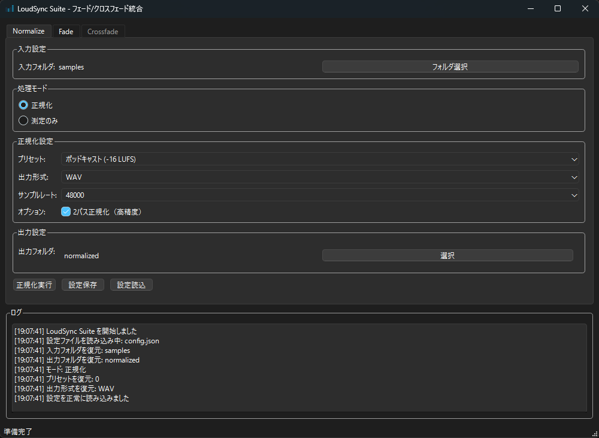

# LoudSync (Python版)

**Audio Loudness Normalization Tool**

PowerShellスクリプトから変換されたPython版のLoudSyncです。複数の音声ファイルのラウドネス（LUFS）/ピークを計測し、指定プリセットまたは参照ファイルに合わせて一括正規化するツールです。

## 機能

- **ラウドネス測定**: LUFS/TP/LRA値の測定とCSV出力
- **音声正規化**: EBU R128準拠の1パス/2パス正規化
- **プリセット選択**: ポッドキャスト、BGM、放送用など
- **参照ファイル**: 指定ファイルと同じラウドネスに調整
- **タスクトレイ**: システムトレイでのバックグラウンド実行
- **多重起動防止**: 同一ディレクトリでの重複実行防止

## 必要環境

- Python 3.8以降
- FFmpeg（システムPATHまたは`bin/ffmpeg.exe`）
- Windows 10以降

## インストール

1. 依存パッケージのインストール:

```bash
pip install aioconsole Pillow pystray
```

2. FFmpegの設置:
   - システムPATHにffmpegを追加、または
   - `bin/ffmpeg.exe`として同梱

## 使用方法

### GUIモード

### GUIモード



1. LoudSync.exe をダブルクリックして実行します。
2. GUIが表示されるので、必要な設定を行います。
3. 「開始」ボタンをクリックして処理を実行します。

### コンソールモード

```bash
# インタラクティブモード（プリセット選択）
python main.py

# 測定のみ
python main.py --mode measure

# プリセット指定での正規化
python main.py --preset -16

# 参照ファイルでの正規化
python main.py --preset reffile --ref-path "reference.wav"
```

### 主要オプション

- `--input-dir`: 入力ディレクトリ（デフォルト: カレントディレクトリ）
- `--output-dir`: 出力ディレクトリ（デフォルト: normalized）
- `--mode`: 処理モード（measure/normalize）
- `--preset`: ラウドネスプリセット（interactive, -16, -18, -19, -20, -23, reffile）
- `--out-ext`: 出力形式（wav, mp3, m4a）
- `--sample-rate`: サンプリング周波数（44100, 48000, 96000）
- `--two-pass`: 2パス正規化（デフォルト有効）
- `--one-pass`: 1パス正規化を強制
- `--overwrite`: 既存ファイルの上書き許可

### プリセット一覧

| プリセット | 目標LUFS | True Peak | 用途 |
|-----------|----------|-----------|------|
| -16 | -16 LUFS | -1.5 dBTP | ポッドキャスト/配信 |
| -18 | -18 LUFS | -1.5 dBTP | BGM（余裕多め） |
| -19 | -19 LUFS | -1.5 dBTP | BGM（標準） |
| -20 | -20 LUFS | -1.5 dBTP | BGM（控えめ） |
| -23 | -23 LUFS | -1.0 dBTP | 放送（欧州基準） |
| reffile | 参照ファイル準拠 | -1.5 dBTP | 指定ファイルに合わせる |

### 設定ファイル

`config.json`でデフォルト設定を変更できます：

```json
{
    "input-dir": ".",
    "output-dir": "normalized",
    "out-ext": "wav",
    "sample-rate": 48000,
    "mode": "normalize",
    "preset": "interactive",
    "two-pass": true,
    "overwrite": false,
    "no-console": false,
    "single-instance-only": true
}
```

## ログとCSV出力

- **ログファイル**: `{output_dir}/LoudSync.log`
- **測定結果CSV**: `{output_dir}/loudness_measurement.csv`（測定モード時）

### CSV出力例

```csv
file,integrated_lufs,loudness_range,true_peak_dbtp,status
audio1.wav,-12.84,11.0,1.28,OK
audio2.wav,-58.28,8.1,-42.76,OK
```

## エラー処理

- **FFmpeg未検出**: PATH確認または`bin/ffmpeg.exe`設置の案内
- **対応外形式**: 対応形式（wav/mp3/m4a）のみ処理、それ以外はスキップ
- **破損ファイル**: エラー情報をログに記録し、次ファイルに続行
- **権限エラー**: 出力先の書き込み権限確認を案内

## トラブルシューティング

### FFmpeg not found

```bash
# システムにFFmpegをインストール
winget install FFmpeg

# または、bin/ffmpeg.exe として配置
```

### Unicode decode error

FFmpegの出力で文字化けが発生する場合、エラーは自動的に置換されます。

### Permission denied

出力ディレクトリの書き込み権限を確認してください。

---

## ライセンス

本ツールはFFmpegを外部プロセスとして使用します。FFmpegのライセンス（LGPL/GPL）に準拠し、必要なライセンス文書を`licenses/`ディレクトリに同梱してください。
